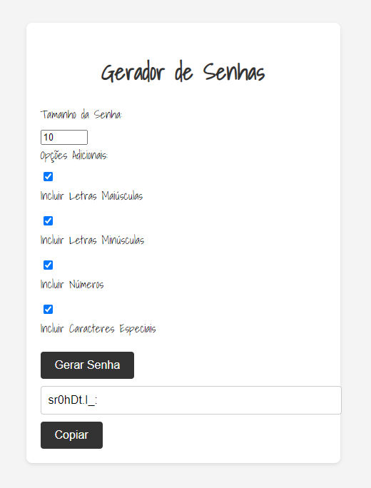

Claro! Aqui está o README para o seu projeto atualizado:

# Gerador de Senhas

Um simples gerador de senhas desenvolvido em HTML, CSS e JavaScript.

Este projeto consiste em uma página web que permite gerar senhas aleatórias com base nas configurações definidas. A senha gerada pode ser copiada para a área de transferência para uso posterior.

## Funcionalidades

- Gera senhas aleatórias com base nas configurações definidas.
- Exibe a senha gerada em um campo de texto.
- Copia a senha para a área de transferência ao clicar em um botão.

## Tecnologias Utilizadas

- HTML
- CSS
- JavaScript

## Como Usar

1. Faça o download ou clone este repositório.
2. Abra o arquivo `index.html` em seu navegador web.
3. Defina o tamanho da senha desejada no campo "Tamanho da Senha".
4. Marque as opções adicionais conforme necessário: "Incluir Letras Maiúsculas", "Incluir Letras Minúsculas", "Incluir Números" e "Incluir Caracteres Especiais".
5. Clique no botão "Gerar Senha" para gerar uma senha aleatória.
6. A senha gerada será exibida no campo de texto "Senha Gerada". Clique no botão "Copiar" para copiar a senha para a área de transferência.

## Personalização

Você pode personalizar este gerador de senhas fazendo as seguintes alterações:

- Modificar o título da página ou estilizá-lo alterando o código HTML no arquivo `index.html`.
- Alterar o estilo da página editando o arquivo `style.css`.
- Adicionar mais opções de configuração para gerar senhas com requisitos específicos.
- Implementar recursos adicionais, como a capacidade de salvar senhas geradas ou gerar senhas personalizadas.